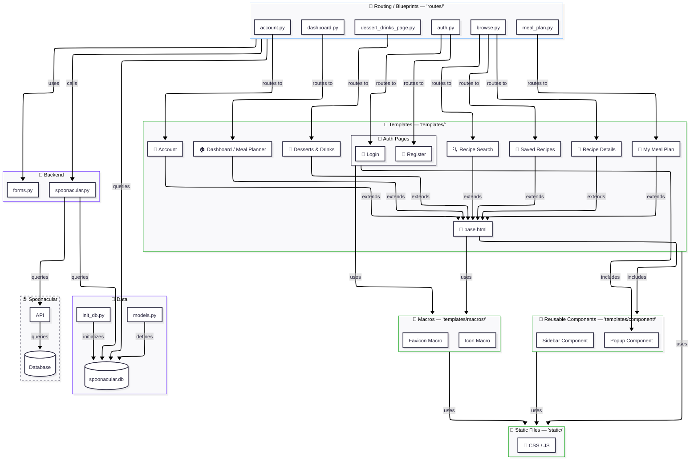

```mermaid
---
config:
  layout: elk
  theme: redux
  look: neo
  htmlLabels: false
  flowchart:
    htmlLabels: false
---

graph TD

%% ───────────────────────────────────────────────
%% STATIC FILES
%% ───────────────────────────────────────────────
subgraph Static["🧩 Static Files — 'static/'"]
S1[📄 CSS / JS]
end

%% ───────────────────────────────────────────────
%% COMPONENTS & MACROS
%% ───────────────────────────────────────────────
subgraph Components["🧱 Reusable Components — 'templates/component/'"]
C1[Sidebar Component]
C2[Popup Component]
end

subgraph Macros["🔧 Macros — 'templates/macros/'"]
M1[Favicon Macro]
M2[Icon Macro]
end

%% ───────────────────────────────────────────────
%% TEMPLATES
%% ───────────────────────────────────────────────
subgraph Templates["📃 Templates — 'templates/'"]
T1[📄 base.html]

P2[🏠 Dashboard / Meal Planner]
P3[🍰 Desserts & Drinks]
P4[🔍 Recipe Search]
P5[📌 Saved Recipes]
P6[📖 Recipe Details]
P7[📅 My Meal Plan]
P8[👤 Account]

subgraph AuthPages["🔐 Auth Pages"]
P9[🔑 Login]
P10[📝 Register]
end
end

%% ───────────────────────────────────────────────
%% ROUTES
%% ───────────────────────────────────────────────
subgraph Routing["🧭 Routing / Blueprints — 'routes/'"]
R2[dashboard.py]
R6[meal_plan.py]
R3[dessert_drinks_page.py]
R4[browse.py]
R7[auth.py]
R8[account.py]
end

%% ───────────────────────────────────────────────
%% BACKEND
%% ───────────────────────────────────────────────
subgraph Backend["🔗 Backend"]
B1[spoonacular.py]
B2[forms.py]
end

%% ───────────────────────────────────────────────
%% DATA LAYER
%% ───────────────────────────────────────────────
subgraph Data["💾 Data"]
D1[models.py]
D2[init_db.py]
D3[(spoonacular.db)]
end

%% ───────────────────────────────────────────────
%% Sponacular API
%% ───────────────────────────────────────────────
subgraph Spoonacular["🌐 Spoonacular"]
A1[API]
A2[(Database)]
end

%% ───────────────────────────────────────────────
%% RELATIONS
%% ───────────────────────────────────────────────

%% Routing to Pages
R2 -->|routes to| P2
R3 -->|routes to| P3
R4 -->|routes to| P4 & P5 & P6
R6 -->|routes to| P7
R7 -->|routes to| P9 & P10
R8 -->|routes to| P8

%% Page templates use base.html
P2 & P3 & P4 & P5 & P6 & P7 & P8 -->|extends| T1

%% base.html includes components and macros
T1 -->|includes| Components
T1 -->|uses| Macros

%% Auth pages use components and macros directly
AuthPages -->|includes| C2
AuthPages -->|uses| Macros

%% Static use
Templates & Components & Macros -->|uses| Static

%% Routing and Backend depend on DB
Routing -->|uses| B2
B1 & Routing -->|queries| D3
D1 -->|defines| D3
D2 -->|initializes| D3

%% Backend Access
Routing -->|calls| B1

%% API-Access
A1 -->|queries| A2
B1 -->|queries| A1

%% Stylized borders
style Spoonacular stroke-dasharray: 5 5
classDef routing stroke:#3396ff;
class Routing routing
classDef backend stroke:#6e33ff;
class Backend backend
class Data backend
classDef frontend stroke:#009e07;
class Templates frontend
class Components frontend
class Macros frontend
class Static frontend
```