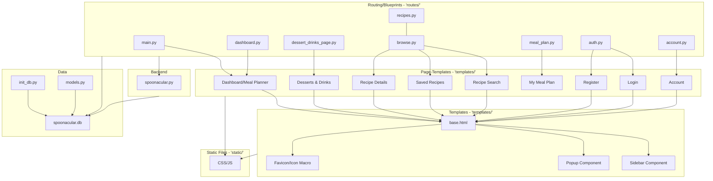

```mermaid
graph TD
    subgraph Static Files[Static Files - 'static/']
        S1[CSS/JS]
    end

subgraph Templates[Templates - 'templates/']
    T1[base.html]
    T2[Sidebar Component]
    T3[Popup Component]
    T4[Favicon/Icon Macro]
end

subgraph Page-Templates[Page-Templates - 'templates/']
    P1[Dashboard/Meal Planner]
    P3[Desserts & Drinks]
    P4[Recipe Search]
    P5[Saved Recipes]
    P6[Recipe Details]
    P7[My Meal Plan]
    P8[Account]
    P9[Login]
    P10[Register]
end

subgraph Routing[Routing/Blueprints - 'routes/']
    R1[main.py]
    R2[dashboard.py]
    R3[dessert_drinks_page.py]
    R4[browse.py]
    R5[recipes.py]
    R6[meal_plan.py]
    R7[auth.py]
    R8[account.py]
end

subgraph Backend
    B1[spoonacular.py]
end

subgraph Data
    D2[init_db.py]
    D1[models.py]
    D3[spoonacular.db]
end

%% Routing Connections
R1 --> P1
R2 --> P1

R3 --> P3

R4 --> P4 
R4 --> P5 
R4 --> P6
R5 --- R4

R6 --> P7

R7 --> P9
R7 --> P10
    
R8 --> P8

Routing --> B1

%% Pages to base.html
P1 --> T1
P3 --> T1
P4 --> T1
P5 --> T1
P6 --> T1
P8 --> T1
P9 --> T1
P10 --> T1

%% Templates to Macros/Components
T1 --> T2
T1 --> T3
T1 --> T4

%% Templates to Static Files
Templates --> S1
Page-Templates --> S1

%% DB Initialization and Models
D1 --> D3
D2 --> D3

%% Backend & Routes to DB
Backend --> D3
Routing --> D3
```